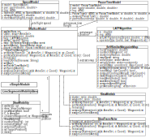

# Slaw++
A SLAW mobility simulator based on the OMNeT++ and INET frameworks

## Description
Slaw++ is a simulator that implements the _Self-similar Least-Action Walk_ model (SLAW). SLAW is a realistic human mobility model that was designed by Lee, Lee, Hong, Kim, Rhee, and Chong (2012). According to their authors, SLAW represents five features of human motion:
  1. Heavy-tail flights and pause-times
  2. Heterogeneously bounded mobility areas
  3. Truncated power-law intercontact times (ICTs)
  4. Self-similar waypoints
  5. Least-action trip planning

Different from other trace-based approaches, Slaw++ is designed keeping in mind performance since it computes the next destination of a walker _on-demand_. This means you do not need a large amount of memory to store the data from mobility trace files. This is due to the fact that Slaw++ computes walker trips when it is need it, i.e., when initializing the simulation and when a walker visits all waypoints of a trip. Therefore, you save several clock cycles since accessing main memory to read the next destination of a walker is avoided. In addition, this approach is especially useful when you need to run long lasting experiments, a large number of them, or dense scenarios with a large number of nodes. By extension, this implies you do not have to worry about running out of samples before the experiments are finished.

Another important features of Slaw++ is that it implements the two available _Individual Walker Models_ (IWMs) of SLAW: the one used in the original trace generator implemented in Matlab and the one presented in Lee et al. (2012). The first IWM is validated by means of a two-sample K-S test so that the flights it produces are statistically equivalent to the flights produced by the original SLAW trace generator. The second IWM is not implemented in other simulation tools, so Slaw++ is possibly the first simulator implementing such IWM. Due to the fact that IWMs are mainly based on intuition, the Slaw++ simulator is designed to implement other IWMs when future analysis on human motion are available.

## Installation
In order to install Slaw++, you must have a functional installation of both frameworks: [OMNeT++ 5 or greater](https://omnetpp.org/download/) and [INET 4 or greater](https://inet.omnetpp.org/Download.html).

Once you have installed the above mentioned frameworks, follow these steps:
  1. Clone [Slaw++](https://github.com/Ryuuba/slaw)
  2. Modify the INETDIR variable in the Makefile so that the value matches with the directory you compiled the INET framework
  3. Execute the make makefiles command
  ```bash
  $ make makefiles
  ```
  4. Execute the make command
  ```bash
  $ make
  ```
  5. Done!

## Arquitecture
The Slaw++ simulator is based on the following architecture. 

The _IWalkerModel_ is a simple module extending the cSimpleModule class from OMNeT++. This interface is implemented by the SlawMatlab and SlawTransNetw; both of them are IWMs. You must implement this interface in order to implement other IWMs. The SlawMobility is a simple module that inherits the functionality of the LineSegmentsMobility class from the INET framework. These relation is done since SLAW is a mobility model based on line segments and pause times, as the random waypoint (RWP) model. As the arrow connecting the IWalkerModel box with the SlawMobility box suggests, a simulation only includes one module implementing the _IWalkerModel_ interface regardless the number of nodes in a experiment. This is done in order to save memory since the are several data structures that can be shared among walkers.

The remaining modules corresponds to the speed model, the pause time model, the Least-Action Trip Planning (LATP) algorithm, and the Self-similar map. These ones are not simple modules, but objects helping the module implementing the _IWalkerModel_ interface.

## References
Lee, K., Hong, S., Kim, S. J., Rhee, I., & Chong, S.  (2012, April).  SLAW: self-similar least-action human walk. _IEEE/ACM Transactions on Networking_, 20(2), 515–529.
Rhee, I., Shin, M., Hong, S., Lee, K., Kim, S. J., & Chong, S. (2011, June). On the levy-walk
nature of human mobility. _IEEE/ACM Transactions on Networking_,19(3), 630–643
