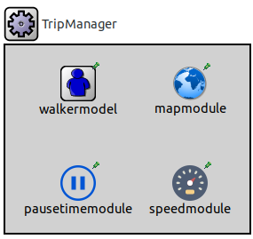

# Slaw++
A SLAW mobility simulator based on the OMNeT++ and INET frameworks

## Description
Slaw++ is a simulator that implements the *Self-similar Least-Action Walk* model (SLAW). SLAW is a realistic human mobility model that was designed by Lee, *et al.* (2012). According to their authors, SLAW represents five features of human motion:
  1. Heavy-tail flights and pause-times
  2. Heterogeneously bounded mobility areas
  3. Truncated power-law intercontact times (ICTs)
  4. Self-similar waypoints
  5. Least-action trip planning

Different from other trace-based simulation approaches, Slaw++ is designed keeping in mind performance since it computes next destinations *on-demand*. This means you do not need a large amount of memory to store the data from mobility trace files. 

Slaw++ achieves performance since it computes next waypoints when it is need it, i.e., when initializing the simulation, as well as when a walker reaches a waypoint. Therefore, you save several clock cycles since accessing main memory to read the next destination of a walker is avoided.

This approach is especially useful when you need to run long lasting experiments, a large number of them, or dense scenarios with a large number of nodes. By extension, this implies you do not have to worry about running out of samples before the end of an experiment is reached.

Another important feature of Slaw++ is that it implements the two available *Individual Walker Models* (IWMs) of SLAW: the one used in the original trace generator implemented in Matlab and the one presented by Lee et al. (2012). We denote these models as m-wm and t-wm, respectively.

The m-wm is validated by means of a two-sample K-S test so that the flights it produces are statistically equivalent to the flights produced by the original SLAW trace generator.

The t-wm is not implemented in other simulation tools, so Slaw++ is possibly the first simulator implementing such walker model.

Due to the fact that IWMs are mainly based on intuition, the architecture of the Slaw++ simulator is designed to easily implement other IWMs when future analysis on individual walker models are available.

## Installation
In order to install Slaw++, you must have a functional installation of both frameworks: [OMNeT++ 5 or greater](https://omnetpp.org/download/) and [INET 4 or greater](https://inet.omnetpp.org/Download.html). The INET framework must be compiled as a static library. Also, you have to install de [CGAL library](https://www.cgal.org/).

Once you have correctly installed the above mentioned library and frameworks and, follow these steps:
  1. Clone [Slaw++](https://github.com/Ryuuba/slaw)
  2. Add the directory of slaw's images to your OMNETPP_IMAGE_PATH in .bashrc or the corresponding configuration file. Take care you correctly set the path of the OMNeT++ and INET framework, as well as the path of Slaw++, e.g.:
  ```bash
  export OMNETPP_IMAGE_PATH="$HOME/omnetpp5/images;$HOME/slaw/images;$HOME/inet4/images"
  ```
  3. Execute the make makefiles-so command to generate a static library in release mode.
  ```bash
  $ make makefiles-so
  ```
  4. Execute the make command.
  ```bash
  $ make
  ```
  5. Done!

## Run an example

The `opp_run` command provided with the OMNeT++ framework loads all configuration files, NED files and libraries needed to run a simulation.

The following command launch the QT environment so that you can select some of the experiments preloaded in by Slaw++. Note that the command is executed on the simulations directory. In addition, we assume you install both the INET and OMNeT++ framework on your home directory.

```bash
~/slaw/simulations$ opp_run -l ../src/SLAW -l ../../inet4/src/INET -l CGAL -f omnetpp.ini -n .:../src:../../inet4/src/inet -u Qtenv
```

## Architecture
The Slaw++ simulator is based on the following architecture. A general explanation about all classes making up this simulator is provided as follows. The diagram shown in Figure 1 is used to support the explation.

  
Figure 1. Slaw++ architecture.

In an OMNeT++ simulation, all classes describing simple modules (C++ objects executing some functionality of the simulation) must extent the `cSimpleModule` class. The inherited member functions from `cSimpleModule` let the objects (modules) initializes their state, handle messages from others and react to timer events.

The *IWalkerModel* abstact class extends the `cSimpleModule` class. The *IWalkerModel* class defines all functionalities related to the SLAW model, along with the objects and data structures needed to perform a SLAW walk. All green boxes in Figure 1 corresponds to the classes needed to perform a SLAW walk. 

Simple modules implementing the *IWalkerModel* class have access to:
  - a `SelfSimilarMap` object,
  - an object implementing the `LATPAlgorithm` (least-action trip planning algorithm),
  - a simple module implementing the *ISpeedModel* class that computes speed samples,
  - a simple module implementing the *IPauseTimeModel* class that computes pause time samples.

The `SelfSimilarWaypointMap`, the `LATPAlgorithm`, the *ISpeedModel*, and the *PauseTimeModel* are classes whose instances (objects or simple modules as appropriate), complements the funcionality of the classes implementing the *IWalkerModel* abstract class.

Both the `SlawMatlab` and `SlawTransNetw` classes extend and implement the *IWalkerModel* class. These classes describe individual walker models, that is, the m-wm and the t-wm, respectively.

  
Figure 2. Components of the SLAW Trip Manager.

The instances of the above-mentioned classes are simple modules making up the SLAW Trip Manager compound module, as Figure 2 shows. Communications among these simple modules are done by method invocation.

The OMNeT++ framework provides an interface to communicate simulation modules by passing messages. This communicaction paradigm is not necessary to compute SLAW walks. Thus, SLAWTripManager goes without it.

A simulation only includes an instance of the SLAWTripManager regardless the number of mobile hosts in an experiment. The centralization of the data utilized to compute trips is done in order to easily shared several data structures and objects with simulation modules that could required such means.

Figure 3 shows the architecture of an mobile ad-hoc host from the INET framework. Among all elements integrating the ad-hoc host, there is module Mobility implementing an interface named `IMobility`. In order to perform a SLAW walk, the type of the module implementing IMobility must be `SlawMobility`.

  
Figure 3. INET ad-hoc host.

The `SlawMobility` class inherits the functionality of the `LineSegmentsMobility` class from the INET framework. This relation is established since SLAW is a mobility model based on line segments and pause times, as the well-known random waypoint (RWP) model.

Communications between the instance of the `SlawMobility` class and the SLAWTripManager also are done by method invocation.

In a simulation, computations concerning the position of mobile hosts are needed in order to obtain statistics from flights and inter-contact times, etc. Implementations of the *IObserver* abstract class perform this taks.

The *IObserver* class defines the methods that observers must extend and implement in order to receive information about a phenomenon to be analyzed, e.g., the flight length distribution, or the inter-contact time distribution, or a trip traveled by a given walker.

Observers gather data to produce statistics. There are four observers available: the flight length observer, the trip observer, the position observer, and the connectivity observer. They receive data from mobile host through the signal mechanism that OMNeT++ provides.

Figure 4 shows a simulation where all instances of Slaw++ are ready to compute SLAW walks

  
Figure 4. Slaw++ simulation.

## Initialization process
In an OMNeT++ simulation, simple modules perform initialization tasks by calling the _initialize()_ member function, which is inherited from the `cSimpleModule` class. This member function is used to set simulation parameters of objects that are not available when the constructor runs. The method _initialize()_ runs just before the simulation starts executing. Besides, the initialization process could be done in stages. This means it is possible to determine the order in which module parameters are set.

In Slaw++, the initialization process requires five stages in order to correctly connect walker modules with the _SlawTripManager_. This manager is a compound module integrated by an simple module implementing the _IWalkerModel_ class, a `SelfSimilarMap` object, an instance of the `LATPAlgorithm` class, an simple module implementing the _ISpeedModel_ class and a simple module implementing the _IPauseTimeModel_ class.

The first simple module to be initialized (at stage 0) is the one that implements the _IWalkerModel_ class: either a module instanced from the `SlawMatlab` class or a module instanced from the `SlawTransNetw` class. Regardless the kind of module, they have to create an instance of the `LATPAlgorithm` class as well as an instance of the `SelfSimilarMap` class just in the stage 0. After that, this kind of simple modules have to be connected with the simple modules corresponding to the pause time model and the speed model. Connections with these simple modules have to be established at stage 3.

During the stage 1 walkers are initialized. This initialization is done by connecting the `SlawMobility` simple module with the simple module implementing the _IWalkerModel_ class. This connection lets walkers obtain the following elements:

  - ID
  - set of confined areas Ck
  - set of unvisited waypoints Tk
  - starting waypoint

Then, during stage 2 and stage 4, walkers initialize all variables related to the `LineSegmentMobility` class, which is class defining all methods needed to carry out a walk make up by straight lines and pause times.

Simple modules instanced from derived classes of both the _IPauseTimeModel_ class and _ISpeedModel_ class are initialized during state 0. Then, the instance of the _IWalkerModel_ class establishes a connection to those modules at stage 3.

Finally, an observer module is initialized. Since this module has no dependecies with any module from the _SlawTripManager_ and walkers, it could be initialized at any stage, e.g., stage 0.

### Initialization of a walker model module
These are the parameters that are setup during the stage 0 of the initialization process performed by the instance of the class derived from the _IWalkerModel_ class:

  * the name of the walker model (`walkerModel`)
  * the number walkers in a simulation (`walkerNum`)
  * the planning degree, which is an input of the LATP algorithm (`planningDegree`)
  * The initial list of confined areas (optional)
  * the self-similar map, denoted as `map`, which needs these parameters:
    
    * the clustering radius used to compute waypoint clusters (`clusteringRadius`)
    * the name of the file containing the coordinates (x, y) of the self-similar distributed waypoints (`mapName`)
    * the self-similarity exponent H (`hurstParameter`)

Then, during stage 3 that instance initializes a pointer to the simple module corresponding to the _IPauseTimeModel_ class. Also, a pointer to the simple module instanced from a derived class of the _ISpeedModel_ class is initialized.

The optional initialization of confined areas is done by loading a file containing sets of waypoint clusters for each walker. This initialization step is performed only if such data are available. In other case, it is possible to run tasks for setting up such waypoint clusters or compute the initial waypoint of a walker. These tasks are done according to an individual walker model. Thus, the initialization process of both the `SLAWMatlab` and the `SLAWTransNetw` models is different.

In addition to the above mentioned configurations, walker-model objects from the SLAWMatlab class also set the cluster ratio (`clusterRatio`) and waypoint ratio (`waypointRatio`). These variables determines the number of confined areas per walker and the number of waypoints to be visited by a walker, respectively.

The SlawMatlab walker model indicates the number of areas per walker is computed through the following assignation:

```C++
unsigned portion = ceil(map->getNumberOfAreas() / clusterRatio);
```

Immediately after the above assignation, the confined areas are assigned to each walker according to their weight (popularity degree) in such a way that an area is more popular if several waypoints integrates it.

In the case of objects from the `SlawTransNetw` class, the number of confined areas per walker is computed by sampling an discrete uniform probability function U{a, b}. Once the number of areas of each walker is computed, the specific areas per walker are determined according their weight, just as objects from the SlawMatlab class does this task. This IWM does not utilize neither the cluster ratio nor the waypoint ratio since it computes the number of confined areas per walker and the number of waypoints to be visited by a walker following other criteria.

### Initialization of pause-time-model simple modules

The pause-time-model simple module is initialized at stage 0 and it requires the value of these parameters:

  * The `BParetoPauseTimeModel` requieres to indicate the minimum value of the distribution xmin, the maximum value of the distribution xmax, and the shape parameter alpha.
  * The `ConstantPauseTimeModel` only needs to set a constant pause time value.

### Initialization of speed-model simple modules

The speed-model simple module requieres the user set the following parameters, which are assigned at stage 0:

  * The `RheeSpeedModel` class does not need to set any parameter since this model computes a speed observation in function of a flight length, which is computed on run time.
  * The `ConstantSpeedModel` class read from the configuration file a constant speed value, which is assigned to all walkers
  * The `NormalSpeedModell` class requires the user set the parameters of the normal distribution: the mean value and the standard deviation 


### Initialization process of walker modules

The main functionality of walkers is described by the `SlawMobility` class, which inherits from the `cSimpleModule` class the member function _initialize()_. Into this member function, walkers get a pointer to the module whose derived class implements the _SlawTripManager_. Once that pointer is correctly initialized, walkers use the pointer to invoke a member function named `setWalkerState()`, which sets the confined areas, the first list of destinations, and the initial waypoint of a walker. All these parameters are set up according to a given walker model.

When the simulation is configured to analyze mobility using the m-wm, the `SlawMatlab` class computes the areas to be visited by a walker in a trip. This process is done by changing the original set of confined areas of a walker in order to one area will be randomly replaced by another one that is drawn without considering its weight.

Then, waypoints are drawn from areas to built the list of unvisited waypoints. The number of waypoints that will be visited in a given area are computed by means of the following code line:

```C++
    //aaa is an ugly variable name from the SLAW MATLAB trace generator
    double aaa = double(area->size()) / waypointRatio;
```

If `aaa` < 1.0, i.e., the number of waypoints to be taken from a given area is less than one, then only a waypoint will be randomly drawn from such area. Otherwise, the number of waypoints depends on the fractional part of `aaa`. If this part is less than a sample drawn from a uniform distribution U(0, 1), then the number of waypoints equals the integer part of `aaa` plus one. In other case, number of waypoints to be drawn equals the integer part of `aaa`. This criterion is taken from the original SLAW trace generator. Finally, the initial waypoint is computed by randomly taken from the destination list a waypoint.

When the walker invokes the _setWalkerStater()_ member function of a `SlawTransNetw` simple module, a walker gets its set of confined areas, its home waypoint and its first list of unvisted waypoints. The first parameter is gotten from the values the walker module computed during its initialization step. The home waypoint of a walker corresponds to a waypoint randomly drawn from the set of confined areas of such walker. Finally, the destination list is computed in two steps. First, the random component of a trip is computed by drawing between 5% and 10% of waypoints from an area not in the set of confined areas of a walker. Then, a maximum of 120 or 150 waypoints are drawn from the confined areas of a walker, except by one area randomly discarded. It is possible that such maximum could not be reached.

#### Initialization of observer modules

The most simple initialization process of the observers is the one corresponding to the trip observer, which only reads the sample size. The flight-length observer only established the number of observations to be gathered. In addition, it sets its functionality up by reading whether it has to classify flights into inter-flights or intra-flights or not.

The initialization process of the `Position`, `ContactTime`, and `InterContactTime` observers is more complicated than the corresponding process of the other observers. This fact is due to these observer needs to read the number of nodes to compute the size of the several data structures. In addition, these observers needs the coverage radius of walkers as well as the dimension of the simulation area to divide it into a certain number of squares. Finally, it reads the number of observations to be captured.

## References
Lee, K., Hong, S., Kim, S. J., Rhee, I., & Chong, S.  (2012, April). SLAW: self-similar least-action human walk. _IEEE/ACM Transactions on Networking_, 20(2), 515–529.
